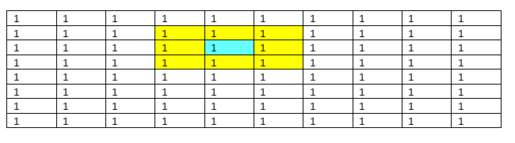
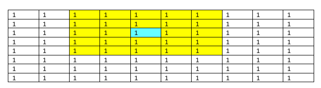
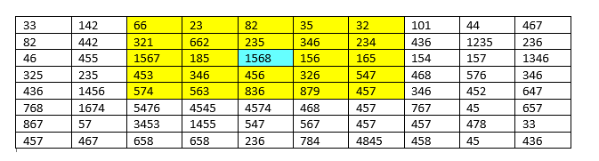
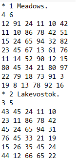

# Earthquake
> Simple earthquake simulation, each of the given 1..9 regions contains 2 matrixes, one for the possible economic loss and another for the possible number of deaths after the earthquake, the program will calculate the total cost/# of victims and other relevant data.

## Table of contents
- [Earthquake](#earthquake)
  - [Table of contents](#table-of-contents)
  - [Introduction](#introduction)
  - [Requeriments](#requeriments)
  - [Input data](#input-data)
  - [Output](#output)
  - [Technologies](#technologies)
  - [Setup](#setup)
  - [Status](#status)
  - [Inspiration](#inspiration)
  - [Contact](#contact)

## Introduction

Earthquakes are measured by their intensity, usually with the Ritcher's scale, generally earthquakes have a magnitude between zero (0) and ten (10) degrees in that scale. However, measuring the consequences of an earthquake shouldn't be limited of the intensity of it, economic loss and number of victims should also be taken in account.

## Requeriments

1. The territory given will be a record with 1 to 9 regions. Each geographic region is represented by a matrix (M x N) where each item inside represents a geographic grid. Each region doesn't have more than 900 grids (M = 30 and N = 30 as maximum)
 
2. Each earthquake has an epicenter, which is the spot where it is iniciated, the epicenter will be represented by a geographic grid [i, j].

3. Each geographic region has 2 matrixes M x N, one represents COST. each grid represents economic losses to consider if an earthquake attacked given zone. There's as well a matrix that represents DEATHS, where the estimation of human losses will be saved. This data is rounded up and expressed as integer numbers. 

4. The expansive wave of the earthquake is circular and depends of its degree, thus an earthquake of 1 degree will affect all the grids nearby the epicenter, an earthquake of 2 degrees will affect the grids nearby the epicenter and the grids nearby the ones affected by an earthquake of 1 degree and so on. For example (Cyan represents epicenter, yellow zone affected): 

5. The total COST or DEATHS will be calculated in this way. Given this earthquake:

The total COST/DEATHS will be: 66+23+82+35+32+321+662+235+346+234+1567+185+1568+156+165+453+346+456+326+547+574+563+836+879+457 = 11114

6. Spanish UI

7. The program must be able to update everything that it is on the matrixes of each geographic area, erasing the actual configuration and loading the information either on a new file or asking for the user the information required to update it manually. It should ask to the user in what way they want to load the data, the maximum value of costs/deaths, the dimensions of both matrixes, etc.

8. The program must be able to save the actual configuration in an output file if the user wants it in that way.

## Input data

Initially, the data of a geographic region is stored in a text file. The file structure is the following:

__Line 1:__

The character "*" represents the start of the information that belongs to a geographic region. After that there's the number of the geographic region and its name, all of it separated by only one blank space. After every name theres a dot (.).

__Line 2:__

M and N values (rows and columns respectively), separated by only one blank space

__Line 3 onwards:__

There's M lines, in each line there's N numbers, all these numbers represent the costs. After that there's M more lines representing deaths values. Each data is separated by only one blank space. This sequence is repeated nine times, one for each geographic region. The program must validate every possible mistake in the file. 

## Output

It's required an interactive menu with the following options

__1. Upload and modify values of COST and DEATHS:__ The program must be capable of loading or modifying the different costs and human losses that belong to a specific geographic region, either manually or using an input file. Aditionally, the program must be capable of loading the values of COST and DEATHS randomly.

__2. Estimate of the consequences of an earthquake:__ Given a geographic region, the user will input the coordinates [i,j] of the epicenter and the intensity in degrees of the earthquake. The program must give as a result the economic and human consequences of it.

__3. Estimate of the maximum and minimum risk zone:__ From the information a region that will be specified by the user, the program will ask for the user the degrees of the earthquake and it will be calculated the epicenter where it would have the greatest and the smallest human losses.

__4. Estimate of the average cost:__  Given a region and the intensity of an earthquake the program must calculate, considering all the possible epicenters of the region the average cost of an earthquake. The average cost will calculated in this way: The sum of all the economic losses in each grid / Number of grids.

__5. Check a geographic region:__ The program must show in screen, in a legible way all the data loaded in a specific geographic region.

__6. Exit:__ The program must facilitate the end of its execution

## Technologies
* Dev Pascal - version 1.9.2

## Setup
Compile this project in any version of Dev Pascal.

## Status
Project is: _finished_

## Inspiration
This program is an old uni project that I finished and polished.

## Contact
Created by [@metalsonic21]